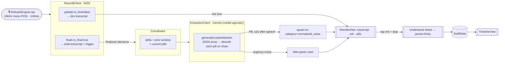

# Voice Daily Note — Prototype Build Spec (SwiftUI + local AI)

**Status:** build-ready · **Date:** 2026-06-17 · **Owner:** Merlijn
**For:** an engineering agent building a working prototype directly in the ditto Swift iOS repo.
**Companion docs:** [CONTEXT.md](CONTEXT.md) (domain language — source of truth for terms) · [spec.md](spec.md) (product spec) · [technical-research.md](technical-research.md) (evidence behind every choice) · [docs/adr/0001-two-stage-pipeline.md](docs/adr/0001-two-stage-pipeline.md)

> This is a **real** prototype: it actually transcribes and actually extracts. **No mocked output.** It runs entirely inside the iOS repo (no Ditto AI Core / Docker dependency), calling Reson8 and Gemini directly.

---

## 1. Goal & scope

Build the **core capture loop** of the voice daily note so the team (and one real patient, next week, in a non-clinical test setting) can feel "facts as you speak." Prototype runs in **English**.

**In scope (build now):**
1. **Home** → tap to start.
2. **Live ramble** — three-band screen: live transcript (top 33%, dim→solid), audio-reactive **orb** (centre), **pills** (bottom 33%).
3. **Pragmatic crisis card** — surfaced from the extraction pass, Ditto-green card overriding the pill band.
4. **"Here's what we understood" sheet** — saved by default; each pill expandable to its verbatim source quote; adjust / reject.
5. **Timeline** — local list of past entries; tap to revisit.

**Deferred (see §11 Backlog):** "stuck?" silence assist · 7-day look-back · pill grounding check · independent crisis module + 112/113 dialer · live mood/affect · Dutch + medical custom model · caregiver sharing.

**Non-goals:** no conversational/therapy behavior; no affect inference from voice; no diagnosis; no shipping-grade auth/secrets; no Vertex-EU residency (prototype uses AI Studio keys).

---

## 2. Architecture

Two-stage pipeline, all on-device-orchestrated, two cloud calls (Reson8 STT, Gemini extraction). See [ADR-0001](docs/adr/0001-two-stage-pipeline.md) for why two-stage over the single-model Gemini-on-audio path.



**Hard latency SLA:** ≤ **2 seconds** from end-of-speech (patient stops saying a fact) to its pill rendered. Instrumented and asserted (§10).

---

## 3. Pipeline contract

### 3.1 Audio capture (`AudioCaptureService`)
- `AVAudioEngine`, install a tap on `inputNode`.
- Convert hardware format (44.1/48 kHz) → **16 kHz mono PCM s16le** via `AVAudioConverter`.
- Emit ~**100 ms** binary chunks to `Reson8Client`.
- Requires `NSMicrophoneUsageDescription`. No audio is persisted — chunks are streamed and discarded.

### 3.2 STT (`Reson8Client`) — verified contract
- **Endpoint:** `wss://api.reson8.dev/v1/speech-to-text/realtime`
- **Auth header on the handshake:** `Authorization: ApiKey <RESON8_API_KEY>` (set on the `URLRequest` backing `URLSessionWebSocketTask`).
- **Query params:** `encoding=pcm_s16le&sample_rate=16000&channels=1&language=en&include_interim=true&include_timestamps=true&include_words=true&include_confidence=true`
- **Send:** binary WS frames (the PCM chunks).
- **Receive (JSON text frames):**
  ```jsonc
  // partial — render dim, may change:
  { "type":"transcript", "text":"i have a head", "is_final":false }
  // final — render solid, TRIGGER extraction:
  { "type":"transcript", "text":"i have a headache", "is_final":true,
    "words":[{"text":"headache","start_ms":1200,"duration_ms":200,"confidence":-0.01}] }
  ```
  `confidence` is a natural log-prob (≤0); `exp()` for probability.
- **Long-monologue guard:** if continuous speech yields no final for ~**4–5 s**, send a flush control to force a final (server replies `{"type":"flush_confirmation","id":...}`) so pills keep flowing. *(Confirm exact flush request shape against Reson8 docs at build time.)*

### 3.3 Extraction trigger (`TranscriptionExtractionCoordinator`)
- On each **final** utterance, build payload `{ new_finalized_text, prior_window (last 1–2 finals), current_pills[] }` and call `ExtractionClient`.
- Debounce finals arriving <300 ms apart into one call.
- **Never** call extraction on partials.
- Record a timestamp at speech-end (use the final's word timings) to measure the 2 s SLA per pill.

### 3.4 Extraction (`ExtractionClient`) — model-agnostic behind a protocol
- **Model:** target `gemini-3.5-flash` with `thinking_level: minimal`; **fall back to `gemini-2.5-flash` (thinking off) → `gemini-2.5-flash-lite`** — whichever measures ≤2 s on-device wins. The model name is config, the SLA is the contract.
- **Access:** Gemini API (AI Studio) API key, direct from the app, via the official **Google Generative AI Swift SDK** `generateContentStream`.
- **`generationConfig`:** `responseMimeType: "application/json"`, `responseSchema` = `ExtractionResponse` (§4.3), `temperature: 0.1`, `maxOutputTokens: ~512`, thinking minimal/off.
- **Streaming parse:** accumulate streamed text; run a balanced-brace splitter over the `pills` array; **decode and emit each `Pill` the moment its `{…}` closes** (element-level), so the first pill renders well under 2 s.
- **System prompt (essence):** "Extract structured facts from this patient's spoken English. Categories: medication, symptom, mood, treatment, side_effect, concern, question_for_doctor. For each, give the value in the patient's own words, the verbatim `source_quote` it came from, an optional natural-language `time`, and `confidence`. **Mood = what they say they feel, never inferred from tone.** Set `urgency`: `crisis` if self-harm, severe danger, or possible medical emergency; `elevated` for a serious symptom/strong concern; else `none`. When `crisis`, add a calm one-line `crisis_message`. Return only the schema."

### 3.5 Dedup
- `normalized_value` = lowercased, trimmed, diacritics-folded.
- Upsert on `(category + normalized_value)`; keep highest `confidence`, latest non-null `time`. A repeated fact = one stable pill (no jitter, because pills only ever come from finalized text).

---

## 4. Data model

### 4.1 `Entry` (SwiftData)
| Field | Type | Notes |
|---|---|---|
| `id` | UUID | |
| `createdAt` | Date | |
| `transcript` | String | full finalized transcript |
| `language` | String | "en" |
| `pills` | [Pill] | relationship |
| `peakUrgency` | String | "none" / "elevated" / "crisis" (highest seen) |

### 4.2 `Pill` (SwiftData)
| Field | Type | Notes |
|---|---|---|
| `id` | String | stable = hash(category + normalizedValue) |
| `category` | enum `PillCategory` | the 7 categories |
| `value` | String | patient's own words |
| `sourceQuote` | String | verbatim transcript span |
| `time` | String? | natural-language, usually nil |
| `confidence` | enum (low/med/high) | internal; not shown as a number |
| `normalizedValue` | String | for dedup |
| `rejected` | Bool | user rejected (kept for undo) |

### 4.3 `ExtractionResponse` (Gemini `responseSchema`)
```jsonc
{
  "pills": [
    { "category": "medication|symptom|mood|treatment|side_effect|concern|question_for_doctor",
      "value": "string", "source_quote": "string",
      "time": "string|null", "confidence": "low|medium|high" }
  ],
  "urgency": "none|elevated|crisis",
  "crisis_message": "string|null"
}
```
`elevated` produces a normal pill (no special UI). Only `crisis` triggers the green card.

---

## 5. Screens & states

### 5.1 Home (`HomeView`)
"ditto today" card: **"Jot down your day."** + one tap → start. (Last-entry nudge deferred.) Tapping begins a new `Entry` and opens `RambleView`.

### 5.2 Live ramble (`RambleView`) — the signature screen
Three equal bands:
```
┌──────────────────────────────┐
│ ░ …around noon the headache ░ │  TOP 33% — TranscriptBand:
│   came back▌                  │  dim partials → solid finals, scrolls up,
│                               │  light gradient fade at very top
│           (   ◉   )           │  MIDDLE — OrbView: central element,
│          tap to stop          │  audio-reactive (pulses with voice amplitude)
├───────────────────────────────┤  BOTTOM 33% — PillTray:
│  💊 anti-nausea   🩹 headache  │  icon-first chips, quiet fade-in, ordered
│  ❓ ask about scan             │  high→low confidence. Pills live ONLY here.
└──────────────────────────────┘
```
- **States:** `idle → listening → (silence) → stopping → understood`.
- **No sound, no haptic, no motion that competes** with the transcript when a pill appears (fade-in only).
- **Stop:** tap the orb. Always available.

### 5.3 Crisis card (overrides PillTray)
When `urgency == crisis`: the bottom band is replaced by a **Ditto-green** card (brand primary — see design-system reference) with the calm `crisis_message` and a **`Reach us`** affordance. Prototype `Reach us` shows a static line ("call 113 / 112"); a `tel:` link is optional. **Calm, not alarming; no full-screen takeover.** Log the event.

### 5.4 Understood sheet (`UnderstoodSheet`)
Presented on stop. Title: **"here's what we understood."**
- Pills listed (grouped by category or flat, ordered high→low confidence). **Saved by default** — the Entry is already persisted; this is review, not a gate.
- **Expand a pill** → full value + **verbatim `source_quote`** ("…the headache came back around noon").
- **Adjust** (edit value, inline) / **Reject** (remove with a "Removed · Undo" snackbar). No mandatory confirmation.
- Actions: "See how this week's going" → Timeline. (Caregiver "tell my family" shown disabled/later.)

### 5.5 Timeline (`TimelineView`)
List of past Entries (newest first), each showing date + a few pill chips. Tap → detail (transcript + pills). 7-day look-back deferred.

---

## 6. Suggested module structure (Swift)

```
VoiceDailyNote/
├── Audio/        AudioCaptureService            (AVAudioEngine → 16kHz PCM chunks)
├── STT/          Reson8Client                   (URLSessionWebSocketTask, partials/finals)
├── Extraction/   ExtractionClient (protocol)    (model-agnostic)
│                 GeminiExtractionClient          (Swift SDK, schema, element-stream parse)
├── Core/         TranscriptionExtractionCoordinator   (wires STT→extraction→pills, dedup, SLA timing)
├── Models/       Entry · Pill · PillCategory · Urgency · ExtractionResponse
├── Store/        EntryStore                     (SwiftData)
└── Views/        HomeView · RambleView (TranscriptBand, OrbView, PillTray, CrisisCard)
                  UnderstoodSheet · TimelineView
```
`ExtractionClient` is a protocol so the model is swappable and the single-model Gemini-on-audio experiment (backlog) can slot in behind it.

---

## 7. Config & secrets
- `RESON8_API_KEY`, `GEMINI_API_KEY` via an untracked `Secrets.xcconfig` (gitignored) — never committed, never shipped.
- `EXTRACTION_MODEL` config string (default `gemini-3.5-flash`, minimal thinking; fallbacks documented in §3.4).
- `LANGUAGE` build toggle (`en` default; `nl` for later).
- `Info.plist`: `NSMicrophoneUsageDescription`.
- Target iOS 17+.

---

## 8. Error handling & edge cases
- **Mic denied** → explain + deep-link to Settings.
- **Reson8 disconnect** → auto-reconnect with backoff; subtle "reconnecting…"; resume streaming. Transcript needs the cloud (no offline STT in v0).
- **Gemini call fails / times out** → that utterance produces no pills; transcript still shows; retry once; never block recording. Log.
- **SLA breach (>2 s)** → pill still renders late; log the breach for the perf report.
- **No facts** → empty PillTray is a valid, expected state (silence/rambling is fine).
- **No network** → show "needs a connection" (on-device STT would fix this — backlog).

---

## 9. Languages
English only for the prototype (`language=en` on Reson8; English system prompt). Dutch + the Reson8 medical custom model + a Dutch drug/clinical lexicon are backlogged (the real product is NL-medical-first).

---

## 10. Acceptance criteria
1. Tap → speak: **live transcript** appears (dim→solid) within ~0.5 s of speech, scrolling in the top band.
2. **Pills appear in the bottom band ≤ 2 s** after the relevant utterance ends. *(Instrumented; logged per pill; a perf assertion fails the build if median >2 s on a reference iPhone.)*
3. **Stop** → understood sheet lists the pills; each **expands to its verbatim source quote**.
4. Pills are **saved by default**; **adjust** and **reject (with undo)** work; the Entry persists and appears in the **Timeline**.
5. A crisis phrase (e.g., self-harm language) produces the **Ditto-green card below the orb**, calm, with `Reach us`.
6. Runs **in English on a real iPhone against real Reson8 + real Gemini** — no mocks anywhere.
7. No audio is persisted; no affect/tone inference occurs.

---

## 11. Backlog (priority-ordered — the full spec beyond this prototype)

**P1 — next fast-follow**
- 7-day **Look-back** after saving (from the 2nd Entry).
- **"Stuck?" assist:** after ~5 s silence, a gentle centred prompt → skippable opener chips (how you feel / meds / symptoms).
- **Dutch** + Reson8 **medical custom model** + Dutch drug/clinical lexicon (the real product language).

**P2 — safety & trust hardening**
- **Pill grounding check** (verify each pill against its source quote; Vertex check-grounding or a self-hosted NLI; tentative styling for low-confidence). See technical-research §3.
- **Independent crisis module** (separate high-recall detector, false-positive-biased) + **tap-to-call 112 / 113** routing + the full in-your-face protocol. Replaces the pragmatic extraction-based card.
- Med name+dose **confirm-on-save** exception.

**P3 — depth & growth**
- Live **mood/affect** from audio — only if it can be made non-intrusive (no "you sound scared").
- **Caregiver sharing** ("tell my family") + consent model.
- A↔B (chat) correlation · health **"Wrapped"** · weekly variant.
- **On-device STT** (offline + GDPR Art. 9 posture) · audio-delete hardening · **Vertex-EU** extraction (production residency).
- Single-model **Gemini-on-audio** experiment behind `ExtractionClient` (the unified-pass idea — A/B vs two-stage; captures affect for free). See technical-research §2/§3.

---

## 12. Open items to confirm at build time
- Exact Reson8 **flush** request shape for the long-monologue guard (docs.reson8.dev).
- Whether `gemini-3.5-flash` minimal-thinking clears the 2 s SLA on a reference device, or we default to 2.5 Flash / Flash-Lite.
- Ditto-green hex + orb animation spec from the design system ([data/design-system](../../data/mockups)).
- Note: `spec.md` still names the STT engine "Resonate" — that is the in-house model; the prototype uses **Reson8** (external vendor). Reconcile when `spec.md` is next revised.

*Built via a `grill-with-docs` session, 2026-06-17. Every architectural choice traces to [technical-research.md](technical-research.md); terms are defined in [CONTEXT.md](CONTEXT.md).*
