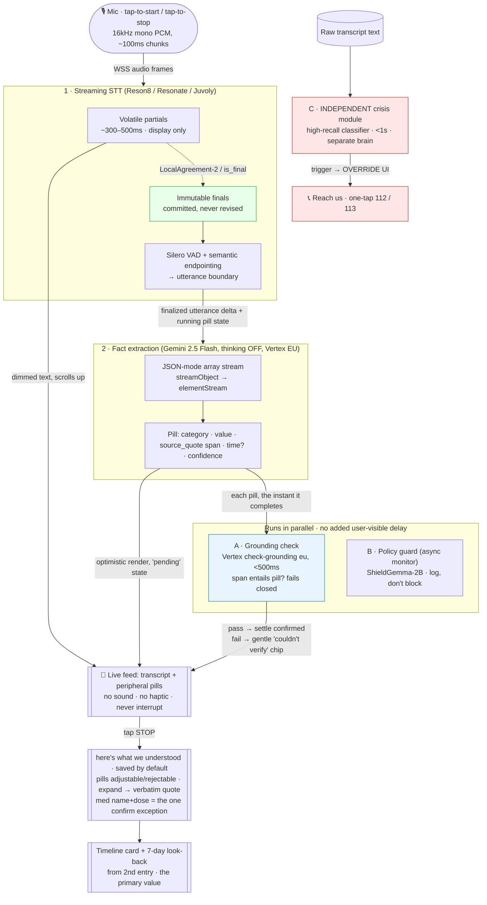

# Prototype B — Voice Daily Note · Technical Research (build input for the spec)

**Prepared for:** ditto.care engineering + product — EU/NL patient-facing health-tech
**Date / access date:** 2026-06-17
**Companion docs:** [research.md](research.md) (product/market case + `§7` streaming-extraction seed) · [spec.md](spec.md) (locked product decisions) · [overview & comparison](../00-overview-and-comparison.md)
**Scope:** the engineering research behind the build — how each proven mechanism works and how it is implemented elsewhere — so the technical spec rests on evidence, not vibes. Six tracks: streaming STT, fast fact-extraction, near-streaming governance, voice-journaling UI, human review/validation UX, patient value.

> **Sourcing.** Inline `[Source, year](url)`. **T1** = peer-reviewed / official vendor docs / standards · **T2** = reputable press / independent benchmark · **T3** = vendor blog / marketing / self-report (FLAGGED — directional). Confidence high/med/low. 🇪🇺 = EU-residency-relevant. `[corpus]` = carried from ditto's vetted M-series. Every latency/WER/cost number carries its citation + tier. **All commercial latency/WER figures are vendor self-reported unless marked T2 — no independent benchmark publishes a Dutch *medical* WER for any engine.**

> **Naming, corrected (read first).** "Reson8" is **[Reson8](https://www.reson8.dev/)** — an external **Amsterdam** speech-AI vendor (founded 2025/26; €5M raised Mar 2026; [EU-Startups, 2026](https://www.eu-startups.com/2026/03/amsterdams-reson8-raises-e5-million-to-build-speech-ai-infrastructure-that-resonates-across-europe/), T2). It is **not** ditto's in-house **Resonate** custom model (the `specs/resonate-custom-model/` Dutch-medical corpus), and not the current incumbent vendor **Juvoly** ([product-context], `[corpus]`). STT for v0 is therefore a genuine **three-way build-vs-buy decision** — see §1. `spec.md` currently names "Resonate" as the STT; that needs reconciling against this finding.

---

## Key takeaways — the six build verdicts

1. **STT is build-vs-buy, and Reson8 is the strongest buy on paper for ditto's exact constraints.** Reson8 is EU-native, supports **Dutch + ~20 European languages**, ships a **healthcare model (50,000+ medical terms, "no latency impact")**, does **text-based domain adaptation up to 1M tokens with no fine-tuning** (<60s to customize), offers **on-prem/VPC**, **zero audio retention**, ISO 27001 ([reson8.dev](https://www.reson8.dev/); [docs.reson8.dev](https://docs.reson8.dev/), T3). But it publishes **no latency-in-ms and no Dutch-medical WER** — "crazy fast" is unverified. **Benchmark it on ditto's own audio before committing.** The non-negotiable architecture, whichever engine wins: a **strict two-channel contract** — volatile partials for display, **immutable finals as the *only* input to extraction** ([W3C Web Speech API, 2024](https://webaudio.github.io/web-speech-api/), T1).

2. **Fact extraction: Gemini 2.5 Flash, thinking OFF, on Vertex EU, JSON-mode array streaming.** Stream pills with the Vercel AI SDK `streamObject({output:'array'})` → `elementStream` (each pill emitted once, complete, **no field jitter**) ([AI SDK, 2025](https://ai-sdk.dev/docs/reference/ai-sdk-core/stream-object), T1). Realistic round-trip ~2.5s/call on 2.5 Flash thinking-off ([Artificial Analysis, 2026](https://artificialanalysis.ai/models/gemini-2-5-flash/providers), T2) — **slower than research §7's "<1s" aspiration**, so extract the *new utterance delta* (not the whole growing transcript) and let the first element stream early. Cost is sub-cent per session.

3. **Governance is real and it is the actual safety mechanism — but off-the-shelf guardrails do NOT solve it.** NeMo/Llama Guard/ShieldGemma gate *harm/PII/jailbreak*, not *medical correctness* ([NVIDIA, 2025](https://developer.nvidia.com/blog/stream-smarter-and-safer-learn-how-nvidia-nemo-guardrails-enhance-llm-output-streaming/), T3). The layer that catches a misheard/misattributed med is a **grounding check**: every pill carries a transcript span; verify the span entails the pill. **Vertex check-grounding** (`eu` region, **<500ms**, byte-offset claim attribution, **fails closed** on partial matches — wrong dose → no citation) runs **in parallel** so it adds no user-visible delay ([Google Cloud, 2024-26](https://docs.cloud.google.com/generative-ai-app-builder/docs/check-grounding), T1). Nabla's "atomic-facts, keep only facts with definitive proof" is the closest shipped analog ([Nabla, 2024](https://www.nabla.com/blog/how-nabla-uses-whisper), T3).

4. **Crisis detection must be a separate brain, biased to false positives.** 2025-26 consensus across four independent papers: a **dedicated, high-recall** suicide/self-harm classifier that does NOT share state with the extraction model ([ASTRA, JMIR Mental Health 2026](https://mental.jmir.org/2026/1/e91367), T1). A generic prompted LLM misses **69-94% of the most-severe cases** ([Nature Sci Reports, 2025](https://www.nature.com/articles/s41598-025-22402-7), T1). On trigger → one-tap NL routing (**112** imminent danger / **113 Zelfmoordpreventie**, free since Oct 2025), not buried in chat ([MHACSAF, Frontiers 2026](https://www.frontiersin.org/journals/digital-health/articles/10.3389/fdgth.2026.1814547/full), T1; [113.nl](https://www.113.nl/heb-je-nu-hulp-nodig/hulplijn), T1).

5. **The live-pills-during-speech UI is genuinely unstudied — instrument it, don't assume it.** Dim-until-final transcript + waveform (not orb) are proven ([Claude Code voice, 2026](https://code.claude.com/docs/en/voice-dictation), T1-vendor; Granola, T2/T3). But **no study evaluates entity pills surfacing while the user is still speaking**; calm-tech ([Weiser & Brown, 1996](https://calmtech.com/papers/coming-age-calm-technology), T1) and dual-task evidence ([PMC9859375](https://www.ncbi.nlm.nih.gov/pmc/articles/PMC9859375/), T1) predict it *can* work if strictly peripheral, but it is the design's highest-risk bet. **Ship it behind an A/B flag** (live pills vs pills-on-stop) and measure whether pills make people trail off.

6. **Validation UX: saved-by-default is right; don't show raw model confidence; provenance = the verbatim quote; one safety exception for meds.** Confirm-all breeds rubber-stamping that fakes assurance without improving accuracy ([NN/g, 2018](https://www.nngroup.com/articles/confirmation-dialog/); [Bravo-Lillo, SOUPS 2014](https://www.usenix.org/system/files/soups14-paper-bravo-lillo.pdf), T1). LLMs are systematically overconfident, so never surface raw confidence numbers ([arXiv 2604.01457](https://arxiv.org/pdf/2604.01457), T1). **The primary patient value is "you won't forget what mattered when it counts"** — the look-back that solves the forgetting problem (patients forget 40-80% of medical info; [Kessels, 2003](https://pubmed.ncbi.nlm.nih.gov/12724430/), T1), with symptom tracking as the clinically-defensible byproduct (Basch +5mo OS; [JAMA 2017](https://jamanetwork.com/journals/jama/fullarticle/2630810), T1).

---

## End-to-end pipeline & architecture

The shape: **show fast, verify in parallel, block only on high-risk, crisis is a separate brain.** Tracks A (grounding) and B (policy) run concurrently with extraction so they add no user-visible delay; Track C (crisis) runs continuously and independently of everything.



**Latency budget (target: facts trail the voice by ~1–2.5s, calm not laggy).**

| Hop | Budget | Source |
|---|---|---|
| STT partial (display) | ~300–500ms | AssemblyAI ~307ms P50, Soniox 249ms time-to-final ([T3]); Reson8 unpublished |
| STT immutable final (→ extraction) | ≤~1s target | LocalAgreement-2 naive 3.3s, must be tuned; commercial ~300ms ([T1/T3]) |
| Extraction utterance-final → first pill | ~0.6s TTFT + stream | Gemini 2.5 Flash thinking-off ~0.61s TTFT, ~157 tok/s ([T2]) |
| Extraction full call | ~2.5s | Artificial Analysis ([T2]) — extract the *delta* to keep this small |
| **A** grounding check (parallel) | <500ms | Vertex check-grounding `eu` ([T1]) — hidden behind next utterance |
| **B** policy monitor (async) | 0ms user-visible | off critical path ([T2]) |
| **C** crisis detection (independent) | <1s | medRxiv emergency-mode ([T1 preprint]) |

The only intentionally-blocking, synchronous element is the **crisis override**. Everything else is optimistic-render-then-settle.

---

## §1 — Streaming STT: Reson8 vs Resonate vs incumbent, and the engine-agnostic contract

### 1.1 The decision: build vs buy vs incumbent

ditto has three live options. They are not mutually exclusive (a buy can bridge while Resonate matures), but v0 should pick one primary.

| Option | What it is | For | Against |
|---|---|---|---|
| **Reson8** (buy) 🇪🇺 | Amsterdam STT vendor; EU GPUs, Dutch + ~20 EU langs, healthcare model (50k+ medical terms), text-based domain adaptation ≤1M tokens (no fine-tune, <60s), on-prem/VPC, zero retention, ISO 27001 ([reson8.dev](https://www.reson8.dev/); [docs](https://docs.reson8.dev/), T3) | Ticks **every** ditto constraint at once: EU residency, Dutch, medical, on-prem, fast to customize. WSS realtime + "turns" endpoints, token auth, Custom Models API. Pricing transparent (Free 600 credits/mo → €20 Pro 6k → €100 Growth 30k; realtime = 2 credits/min) | **No published latency-ms, no Dutch-medical WER** — "crazy fast" unverified. Young company (€5M seed, 2026). Vendor lock-in risk; benchmark + contract for on-prem/SLA before betting v0 on it |
| **Resonate** (build) 🇪🇺 | ditto's own Dutch-medical model; training corpus exists (`specs/resonate-custom-model/`: GP/oncology/cardiology/pharmacy speech + drug/diagnosis lexicons) | Maximum control, on-device GDPR Art. 9 posture, defensible long-term edge in the exact gap nobody fills (Dutch-medical streaming + drug-name safety). LUMC evidence: generic large-v3 already beats Dutch fine-tunes on real clinical conversation ([van Dijk et al., 2025](https://arxiv.org/abs/2508.08684), T1) | Slowest to ship; needs streaming infra (LocalAgreement-2, VAD, endpointing) built from scratch; naive Whisper-streaming latency 3.3–4.8s until tuned ([Macháček, 2023](https://arxiv.org/html/2307.14743v2), T1) |
| **Juvoly** (incumbent) 🇪🇺 | Current STT vendor per [product-context] `[corpus]` | Already integrated; NL medical focus | Re-validate its streaming latency + immutable-final support against the contract below |

**Recommendation:** Lead v0 with **Reson8** *if* a same-day benchmark on ditto's own oncology/GP audio clears the bar set by the contract in 1.3 (immutable finals, <~1s finalization, drug-name accuracy) — it is the only option that satisfies EU + Dutch + medical + on-prem + speed in one box. Keep **Resonate** as the strategic in-house track. Treat the choice as reversible by building to the engine-agnostic WSS contract below, so engines can be swapped and A/B'd.

### 1.2 Immutable vs volatile transcripts — the flicker fix (non-negotiable)

Streaming decoders revise earlier words as more right-context arrives. The production fix is a **two-channel contract**: a volatile/interim stream for display, an immutable/final stream for processing — **feed extraction only the immutable channel.** The cleanest standards statement: *"Final results must not be overwritten or removed… interim results may be overwritten by a newer interim result or by a final result"* ([W3C Web Speech API §4.1, 2024](https://webaudio.github.io/web-speech-api/), T1).

- Commercial engines expose finality explicitly: Google `is_final` + `stability` 0–1 (interim only); Deepgram `is_final` (immutable) orthogonal to `speech_final` (endpoint); Soniox/Gladia/Speechmatics `is_final: false→true` where finals "never change" ([vendor docs], T1). **AssemblyAI inverts it** — "immutable from the start," every word final, ~300ms P50, no volatile channel to filter ([AssemblyAI, 2025](https://www.assemblyai.com/blog/introducing-universal-streaming), T3).
- Whisper-class (Resonate) commit strategy: **LocalAgreement-2** — freeze a prefix when two consecutive overlapping decodes agree ([Macháček, 2023](https://arxiv.org/html/2307.14743v2), T1). Naive latency 3.3s (EN) / 4.4s (DE) on an A40 — must be tuned (smaller min-chunk + Silero VAD re-seg + CTranslate2 backend) toward <1s.
- **Partials run a weaker model** (Gladia uses a smaller model for partials; Speechmatics partials 10–25% less accurate, their interim `confidence` is meaningless) ([vendor docs], T1) — a second reason to **never extract from partials.**

### 1.3 Endpointing — semantic, not silence-only (the target user pauses mid-thought)

Fatigued oncology patients trail off; a fixed silence threshold truncates them. Three families, increasing sophistication: silence endpointing → acoustic VAD → semantic/neural turn detection ([LiveKit, 2025](https://livekit.com/blog/turn-detection-voice-agents-vad-endpointing-model-based-detection), T3).

- **v0:** **Silero VAD** (32ms windows, <1ms/chunk CPU, ~2MB, MIT) for speech gating + a silence backstop ~700–1000ms to fire extraction.
- **v0.5:** layer a lightweight semantic turn detector — **Pipecat Smart Turn v3** (8MB, ~12ms CPU, includes Dutch) or LiveKit's Qwen-0.5B text detector — to cut the fixed-silence penalty ([Daily/Pipecat, 2026], T3). Vendor reference points: Deepgram Flux 260ms end-of-turn P50; Soniox semantic `<end>` token; AssemblyAI `min_turn_silence` 400ms default.

### 1.4 Drug-name biasing + the post-ASR safety gate (mandatory, build for v0)

A misheard medication is a **safety event, not a typo**: unedited speech-recognition clinical notes had a 7.4% error rate, ~96% of raw notes contained ≥1 error, a clinically-significant error ~every 250 words ([Zhou et al., JAMA Netw Open 2018](https://jamanetwork.com/journals/jamanetworkopen/fullarticle/2687052), T1). Look-alike/sound-alike (LASA) names are WHO Patient Safety Solution #1 and ~10–25% of med errors ([Bryan et al., 2021](https://bpspubs.onlinelibrary.wiley.com/doi/10.1111/bcp.14285), T1). An ASR substitution between a SALA pair (metformin→metronidazole) silently yields a different, *plausible* drug — dangerous precisely because it looks valid.

- **Biasing:** deep neural biasing beats shallow fusion (CLAS up to 68% relative WER cut on contextual terms, [Pundak, 2018](https://arxiv.org/abs/1808.02480), T1 — research upper bound). Vendor APIs: Gladia `custom_vocabulary` with **phoneme-based matching + per-term pronunciations** (best fit for drug names), Speechmatics `additional_vocab` + `sounds_like[]`, Deepgram keyterm prompting, AssemblyAI `word_boost`. **Reson8's text-based domain adaptation (≤1M tokens, no fine-tune)** is the buy-side equivalent — seed it with the Dutch formulary. Best practice: boost only terms the model actually misses (over-boosting causes false insertions).
- **Post-ASR LASA gate (build this regardless of engine):** when an emitted term lands on one side of a known **ISMP confused-drug-name pair (~528 pairs)** ([ISMP/ECRI](https://home.ecri.org/blogs/ismp-resources/list-of-confused-drug-names), T1), flag it in the UI — **never silently autocorrect** — before it becomes a medication pill.
- **Carry speaker identity on the span.** Speaker-attribution error is a named ambient-scribe failure mode ([npj Digital Medicine, 2025](https://www.nature.com/articles/s41746-025-01895-6), T1) and maps directly to "misattributed medication" (a drug the *clinician* named logged as the patient's). The transcript span must carry who-said-it.

### 1.5 Benchmark table (all vendor self-reported unless T2; WER datasets differ — not apples-to-apples)

| Engine | Latency | WER / medical | Immutable? | EU hosting | Dutch |
|---|---|---|---|---|---|
| **Reson8** 🇪🇺 | "low-latency", **no ms published** (T3) | "10% lower WER vs generic"; 50k+ medical terms (T3) | WSS realtime + "turns"; verify | **Yes — EU GPUs, on-prem/VPC** | **Yes** (Dutch + ~20 EU langs) |
| **AssemblyAI Universal-Streaming** | 307ms P50, P99 1,012ms (T3) | ~91–92% noisy; no medical (T3) | **Yes** (core) | Dublin/EU-West-1 (T1) | **No** in streaming (only slower whisper-rt) |
| **Deepgram Flux / Nova-3 Medical** | Flux 260ms EoT P50 (T2); Nova-3 ~516ms word (T3) | Nova-3 Medical WER 3.44%, recall 93.99% (T3) | Turn-state; finals stable | EU endpoint + **self-host** | **Yes** (`nl`, Apr 2026) |
| **Soniox v4/v5** | **249ms median time-to-final**, P99 310ms (T3) | EN "semantic WER" 1.25%; no medical (T3) | **Yes** | EU sovereign cloud (no true on-prem) | **Yes** (Dutch WER unverified) |
| **Gladia Solaria** | TTFB ~270ms P95; final ~698ms (T3) | ~6% EN; no medical (T3) | **Yes** | `eu-west` (T1) | Yes (Solaria-1 only) |
| **Speechmatics +Medical** | finals 0.7–4.0s (`max_delay`) (T1) | EN medical 7% WER, 96% kw recall (T2/T3) | **Yes** | `eu.rt` + **on-prem K8s** | **Dedicated Dutch medical model** (no public WER) |
| **Whisper-streaming (Resonate-class)** | 3.3–4.8s naive, tunable (T1) | adds ~0.2–2% abs WER vs offline (T1) | Yes (agreed-prefix) | **self-host anywhere** | large-v3 beats Dutch fine-tunes on clinical convo (T1) |

**The honest read:** the only *verified* Dutch-clinical ASR numbers are open Whisper/Voxtral arXiv work, and they show generic large-v3 beating Dutch fine-tunes on real clinical conversation — which both validates Resonate's thesis and sets the bar Reson8 and Resonate must clear. **Benchmark Reson8's Dutch-medical streaming against Deepgram `nl` and Speechmatics medical-NL on ditto's own audio.**

**v0 STT recommendation:** WSS contract (16kHz mono PCM s16le, ~100ms chunks, word-level `text/start_ms/end_ms/confidence`); strict two-channel immutable-final contract; LocalAgreement-2 if Resonate, vendor `is_final` if buying; Silero VAD + semantic endpointing; phoneme drug-name biasing + ISMP LASA gate; dimmed partials → solid finals, extract only finals, persist only finals.

---

## §2 — Fast fact extraction (Gemini 2.5 Flash, Vertex EU)

**Model.** **Gemini 2.5 Flash, `thinking_budget=0`, EU multi-region endpoint (never `global`).** 3.5 Flash is GA but **~5x cost** ($1.50/$9.00 vs $0.30/$2.50 per 1M; +10% EU surcharge from 2026-07-01) and **thinking-first** (`high` pushes TTFT to ~17.75s) — reserve it, with `thinking_level=minimal`, only if extraction quality demands reasoning ([ai.google.dev pricing, 2026-06-15](https://ai.google.dev/gemini-api/docs/pricing), T1; [Artificial Analysis](https://artificialanalysis.ai/models/gemini-2-5-flash/providers), T2). Rely on the Vertex DPA for GDPR; 2.5 Flash is available in `europe-west2`; newest 3.x routes only via EU multi-region today ([Vertex data residency](https://docs.cloud.google.com/vertex-ai/generative-ai/docs/learn/data-residency), T1). 🇪🇺

**Trigger & call shape.** Commit-on-finalized-utterance — the universal industry pattern (Google `is_final=true`, AWS `IsPartial=false`, AssemblyAI `end_of_turn=true`, NVIDIA Riva all fire NER only on finals; [Google Agent Assist](https://docs.cloud.google.com/agent-assist/docs/extended-streaming), T1). **Extract the new utterance delta + a short prior-context window + running pill state**, not the whole growing transcript — this keeps input small (fast, cheap) and reconciles the ~2.5s full-call latency toward research §7's <1s feel. Keep a **byte-identical stable prefix** (system prompt + schema + few-shot) at the very start so **implicit prefix caching** (default-on, ~90% off, no storage cost) reuses it; **do not use explicit caching** — it has no append mechanism for a growing prefix and bills $4.50/M-tokens/hour storage ([Gemini caching docs](https://ai.google.dev/gemini-api/docs/caching), T1; [Google Dev Forum, 2026](https://discuss.google.dev/t/peculiar-pricing-of-context-caching-and-potential-plans-for-prefix-caching-support/194137/1), T2).

**Schema** (JSON-mode `responseSchema`, `output:'array'`, fields ordered for render priority):
```
Pill: {
  category: enum[medication, symptom, mood, treatment, side_effect, concern, question_for_doctor],
  value: string,            // normalized fact  ──┐ category+value first → render before
  source_quote: string,     // verbatim transcript substring  ┘ confidence/quote (no UI jitter)
  time: string | null,      // optional, nullable
  confidence: enum[low, medium, high]
}
```
Tips applied: enums for closed sets; a `description` per field (acts as inline instruction); shallow nesting; few `required` (let the model omit rather than hallucinate). Gemini guarantees **syntactic** validity only — validate semantically in code ([Gemini structured output](https://ai.google.dev/gemini-api/docs/structured-output), T1). **Gotcha:** on 2.5, structured output + tool-calling are **mutually exclusive** (combining returns 400) — pick JSON-mode for the pills ([agno #2225](https://github.com/agno-agi/agno/issues/2225), T3; lifted on Gemini 3).

**Streaming lib.** **Vercel AI SDK `streamObject({output:'array', schema, model: vertex('gemini-2.5-flash')})`, consume `elementStream`** → each pill emitted once, fully formed, **no field jitter** (the right primitive for discrete pills; `partialObjectStream` field-level jitters). Python backend alternative: **Instructor `Iterable[Pill]` via `from_genai(vertexai=True)`**. **Avoid LangChain here** (`.with_structured_output()` over `.stream()` yields one final object). Pin recent provider versions ([AI SDK streamObject](https://ai-sdk.dev/docs/reference/ai-sdk-core/stream-object); [Instructor Iterable](https://python.useinstructor.com/concepts/iterable/), T1).

**Dedup.** App-side **upsert keyed by `(category + normalized_value)`, keep highest confidence**; track committed turn ids so a fact said three times ("ibuprofen") = one stable pill. Because pills only ever come from finalized text, they don't jitter (the AssemblyAI immutable insight, research §7).

**Source span.** Model returns the verbatim `source_quote`; resolve it back to ASR word-level timestamps app-side (ASR streams don't emit char offsets) to power expand-to-quote + audio replay — the **Abridge "Linked Evidence"** UX ([Abridge](https://www.abridge.com/product), T3).

**Cost.** ~$0.0012 per call on 2.5 Flash (~$1.20/1k calls); a 2-min ~15-utterance session ≈ ~$0.02 uncached, **sub-cent with implicit prefix caching.** Trivial at ditto's scale.

**Open items to verify on ditto's EU endpoint:** exact min-cache-tokens for 2.5 Flash (docs say 2,048; launch blog said 1,024) and live cached-input discount; 3.5 Flash default `thinking_level` and its `minimal` TTFT (only T3 sources).

---

## §3 — Near-streaming governance (the net-new core, and the real safety layer)

**Principle (from Nabla's atomic-facts gate, Anthropic's cascade, the async-monitor-then-gate pattern, and the crisis-detection consensus): show fast, verify in parallel, block only on high-risk, crisis is a separate brain.** Three tracks; A and B run concurrently with extraction (no user-visible delay), C runs independently.

**Central caveat — do not let a guardrail framework masquerade as fact-safety.** NeMo Guardrails, Guardrails AI, Llama Guard, ShieldGemma, OpenAI moderation all gate **harm/jailbreak/PII, not medical correctness** ([NVIDIA NeMo streaming](https://developer.nvidia.com/blog/stream-smarter-and-safer-learn-how-nvidia-nemo-guardrails-enhance-llm-output-streaming/), T3). A misheard medication is not a content-policy violation. The grounding check (Track A) is the actual safety mechanism. (Also: with token streaming, "objectionable text may already have reached the user" — NeMo's own caveat — so blocking guards don't fully work mid-stream anyway.)

### Track A — Pill grounding check (catches the misheard/misattributed med)

Adopt the **AEVS span-anchor pattern**: a pill with **no transcript anchor is rejected outright**; then verify the anchored span *entails* the pill ([MDPI Computers, 2025](https://www.mdpi.com/2073-431X/15/3/178), T1).

- **v0 managed path:** **Vertex check-grounding**, `eu` region, per pill, `enableClaimLevelScore=true` → support score + citation + **byte offsets**, **fails closed on partial matches** (wrong dose → no citation, the safety-favorable behavior), **<500ms**, positioned for real-time chat, same Google Cloud EU residency ditto already uses ([Google Cloud check-grounding](https://docs.cloud.google.com/generative-ai-app-builder/docs/check-grounding); [EU regions](https://docs.cloud.google.com/generative-ai-app-builder/docs/locations), T1). 🇪🇺
- **v0+ self-hosted alternative** (cost/control): an NLI entailment check (premise = transcript span, hypothesis = pill assertion) with **HHEM-2.1-Open** (FLAN-T5, <600MB), **MiniCheck-Flan-T5-Large** (770M, GPT-4-level on LLM-AggreFact, ~400x cheaper, Apache-2.0), or a DeBERTa-v3-small cross-encoder — tens of ms on short pill+span inputs ([MiniCheck, arXiv 2404.10774](https://arxiv.org/abs/2404.10774), T1).
- Runs **in parallel** with extraction; a pill is small, so it finishes well within the time the user speaks the next sentence. **Anti-patterns:** SelfCheckGPT (needs ~20 samples, "not suitable for real-time"), FacTool (open-web retrieval), RAGAS faithfulness (LLM-judge, offline eval).

### Track B — Policy/content guard (async monitor, low priority)

A small classifier — **ShieldGemma-2B** (same Google EU ecosystem; the 2B is the "online/real-time low-latency" pick, 9B/27B only ~1.2–1.7% more accurate) or **Qwen3Guard-Stream-0.6B** (purpose-built token-level streaming guard, 119 languages) — runs **async as a monitor, logging not blocking**, because the harm base-rate in medical capture is low and it does NOT verify medical correctness ([Google Developers, 2024](https://developers.googleblog.com/en/smaller-safer-more-transparent-advancing-responsible-ai-with-gemma/); [Qwen3Guard, arXiv 2510.14276](https://arxiv.org/abs/2510.14276v1), T1). **Do not route patient text to OpenAI moderation** (US, GDPR). 🇪🇺

### Track C — Independent crisis-detection module (separate brain, false-positive-biased)

The 2025-26 consensus, across four independent papers: a **dedicated, high-recall** suicide/self-harm classifier that does **NOT share state** with the extraction model — *"a system cannot be its own safety monitor"* ([ASTRA, JMIR Mental Health 2026](https://mental.jmir.org/2026/1/e91367), T1). An emergency-mode independent classifier hit **98.9–100% recall at <1s** ([medRxiv, 2026](https://www.medrxiv.org/content/10.64898/2026.01.12.26343914v1.full), T1 preprint). **Why a prompted LLM is not enough:** zero/few-shot LLMs miss **69–94% of the most-severe cases** (very-high-risk sensitivity 0.06–0.31) ([Nature Sci Reports, 2025](https://www.nature.com/articles/s41598-025-22402-7), T1). Tune for **recall over precision** (smoke-detector bias).

On trigger → **override the UI** with NL routing per MHACSAF's Hotlines dimension (one-tap, not buried, no broken links): **`tel:112`** imminent danger; **113 Zelfmoordpreventie** (free short number / chat deep-link, 24/7, free since Oct 2025) for ideation without imminent danger ([MHACSAF, Frontiers 2026](https://www.frontiersin.org/journals/digital-health/articles/10.3389/fdgth.2026.1814547/full); [113.nl](https://www.113.nl/heb-je-nu-hulp-nodig/hulplijn), T1).

**EU AI Act note:** the Art. 5(1)(f) **emotion-recognition prohibition applies only to workplace/education** — a patient-facing health app is outside it, and a text-based crisis classifier on conversation text arguably isn't an "emotion-recognition system" (that's defined on *biometric* data) and falls under the medical/safety exception. **Frame it in product/legal copy as crisis/safety detection, NOT mood/well-being analytics**, and operate on text not biometrics ([AI Act Art. 5](https://artificialintelligenceact.eu/article/5/); [FPF, 2026](https://fpf.org/blog/red-lines-under-eu-ai-act-unpacking-the-prohibition-of-emotion-recognition-in-the-workplace-and-education-institutions/), T2). 🇪🇺

### What blocks vs flags

| Signal | Action | Why |
|---|---|---|
| Pill with no transcript anchor | **Block** (drop, never show) | No source = hallucination (AEVS) |
| Pill grounding score < threshold (~0.6) | **Flag tentatively** (greyed / "tap to confirm"), don't commit to record | Medical models *under-abstain* — gate aggressively low ([MedAbstain, 2026](https://arxiv.org/html/2601.12471v2), T1) |
| Pill grounded above threshold | Show normally | Verified |
| Crisis trigger | **Override UI → emergency mode** (synchronous) | Life-safety; the one thing worth blocking for |
| Policy/content | **Log async** | Low base rate; not the core risk |

### Optimistic UI without flicker

Show each pill the instant Gemini emits it, in a **"pending verification"** state (subtle border/spinner) until Track A returns. Pass → settle to confirmed. Fail → **explicit gentle correction, not silent retraction** (users distrust output that silently changes; [PMC12365265, 2025](https://www.ncbi.nlm.nih.gov/pmc/articles/PMC12365265/), T1): collapse to a "couldn't verify this — tap to review" chip referencing the audio.

**Prior art:** **Nabla** splits each note into atomic facts, LLM-checks each against the transcript, keeps only facts with "definitive proof" — the closest shipped analog to the pill-grounding gate ([Nabla, 2024](https://www.nabla.com/blog/how-nabla-uses-whisper), T3). **Abridge** = verification-by-attribution + clinician gate. **Reality check:** ambient-scribe hallucinations in **31% of notes vs 20% human** ([PMC12586549, 2025](https://pmc.ncbi.nlm.nih.gov/articles/PMC12586549/), T1) — and **83–86% of scribe errors are *omissions*** ([PMC12973079, 2026](https://pmc.ncbi.nlm.nih.gov/articles/PMC12973079/), T1), which provenance **cannot** catch. Consider a lightweight "did we miss anything?" free-add path; don't assume highlighting added facts is sufficient review.

**Caveats to carry:** vendor latency/recall numbers (Vertex <500ms, Nabla, the 98.9% recall) are self-reported — **benchmark on ditto's EU endpoint with real pill+span sizes before committing.** Verify MiniCheck/HHEM commercial licenses.

---

## §4 — Voice-journaling UI best practices

**Live transcript.** Two visual states only: **interim = dimmed** (~40–55% opacity), **final = solid**; animate dim→solid in place on `isFinal`, **never re-flow finalized lines**. Keep a small rolling window (~last 3–5 lines) in a stable read zone, older lines autoscroll up under a top gradient fade, newest words pinned. This is the **Claude Code voice** pattern ("dimmed until the transcript is finalized") and **Granola**'s "invisible handrail" minimal line-by-line feed with **machine-vs-human color separation** + per-item provenance links ([Claude Code voice, 2026](https://code.claude.com/docs/en/voice-dictation), T1-vendor; [Granola teardown, 2025](https://medium.com/design-bootcamp/how-granola-ai-helped-me-stop-taking-notes-and-start-listening-during-meetings-and-interviews-ff72215b6553), T2/T3). **Anti-pattern:** Otter's dense persistent multi-speaker transcript — too much competing text for a calm single-speaker journal.

**Recording state.** Use a **live waveform** that reacts to the user's voice (doubles as a liveness cue) — **not** a pulsing orb (orbs read as *assistant* agents). Claude Code uses a waveform, not an orb — correcting the spec's "like Claude voice mode" reference. Default to **tap-to-start / tap-to-stop** (no sustained hold, kinder to fatigued users) with **auto-stop after ~15s silence + a hard cap (~2 min)** and a gentle "still here, tap to keep going" before auto-stopping. Make recording state, retention, and a one-tap **delete-what-I-just-said** visible and plain-language (GDPR + surveillance-anxiety mitigation).

**Peripheral pills — the highest-risk, unstudied bet.** Calm-tech is the governing frame: information lives in the periphery, moves to center only on demand, "communicate but doesn't need to speak" (favor silent visual status over sound — supports the no-sound/no-haptic rule) ([Weiser & Brown, 1996](https://calmtech.com/papers/coming-age-calm-technology); [Amber Case](https://www.caseorganic.com/post/principles-of-calm-technology), T1/T3). **But speaking and reading both draw on language/working-memory** — a live, changing visual extraction during active speech is a **dual-task** that can make users stop talking to read ([dual-task evidence, PMC9859375](https://www.ncbi.nlm.nih.gov/pmc/articles/PMC9859375/), T1). **No study evaluates entity pills appearing during the user's own continuous speech** — genuinely unstudied. Mitigations: fade-in only, no motion/sound/haptic, low contrast, a dedicated zone that **never displaces the speaking/transcript area**; pills icon-first/compact (progressive disclosure), full detail deferred to the post-stop summary. **Ship behind an A/B flag** (live pills vs pills-on-stop) and **instrument whether pill appearances correlate with speaking pauses/trail-offs**; if they do, throttle/batch pills to natural pauses or move them to the summary.

**Silence / rambling.** No prompt before **~5s** of silence (consistent with the ~4s disengagement signal, biased conservative for a monologue; [arXiv 2402.14863](https://arxiv.org/pdf/2402.14863), T1). After ~5s, surface **optional, skippable opener chips** phrased as gentle continuations ("anything about how you slept?"), **not** interrogatives — show at most 2–3, never stack, dismiss on any speech. Facilitative silence is itself a feature; **Apple Journal** is the positive reference (ignorable suggestions, never blocks the blank state).

**Accessibility (fatigued + older users).** **One-action entry** (tap card → talk) matches mHealth-for-older-adults guidance (critical paths <5 steps, limited actions/screen; [JMIR mHealth, 2023](https://mhealth.jmir.org/2023/1/e43186), T1). Touch targets **≥44×44px** (WCAG 2.2 AAA, not the 24px AA floor — for tremor/fatigue); honor OS Dynamic Type, body ≥17–19pt, contrast ≥4.5:1; contextual in-place hints (not a separate help section); forgiving errors (easy edit/undo, nothing destructive without confirm). **Always preserve the raw transcript behind the summary** (AudioPen/Granola) — the single biggest trust + error-tolerance lever in a clinical context.

---

## §5 — Human review & validation of facts

**Saved-by-default, no per-pill confirm gate.** Defaults are the low-effort path; **confirm-all breeds rubber-stamping that fakes assurance without improving accuracy** ([NN/g, 2018](https://www.nngroup.com/articles/confirmation-dialog/); [Bravo-Lillo, SOUPS 2014](https://www.usenix.org/system/files/soups14-paper-bravo-lillo.pdf); automation-bias 7% commission rate in pathology experts, [Rosbach, 2024](https://arxiv.org/abs/2411.00998), T1). This also implements EU AI Act Art. 14(4)'s anti-automation-bias intent without ceremonial confirmation.

**Provenance = expand pill → exact verbatim spoken quote**, span-level, claim-adjacent, one tap, distinctly styled. This is the highest-attention, most-checked, lowest-verification-cost pattern, and a verbatim patient quote collapses the "citation-theater" gap (only 51.5% of generative-search sentences are actually supported by their citations; [Liu, 2023](https://arxiv.org/abs/2304.09848), T1) ([Source Presentation Effects, 2025](https://arxiv.org/pdf/2512.12207); [NN/g explainable AI, 2024](https://www.nngroup.com/articles/explainable-ai/), T1). **Hard dependency:** the highlighted span must actually contain the fact — a wrong mapping converts provenance from trust-builder to liability (this is exactly what Track A's grounding check protects).

**Do NOT show raw model confidence.** LLMs are systematically overconfident — verbalized confidence clusters 80–100% regardless of accuracy ([arXiv 2604.01457](https://arxiv.org/pdf/2604.01457), T1) — and miscalibrated confidence *impairs* appropriate reliance ([Li, 2024](https://arxiv.org/abs/2402.07632), T1). Avoid global "AI may be wrong" disclaimers (cause under-reliance). Instead **calibrate thresholds against ditto's own per-category correctness data**; below threshold, apply **tentative styling (salient encoding, not faint opacity) + inline "Did you mean X?"** as the pill appears — never a batch confirm-wall (7/8 users dislike "confirm at the end"; [arXiv 2510.05307](https://arxiv.org/pdf/2510.05307), T1).

**Correction affordances.** **Editable input chips** (Material 3: input chips uniquely support edit-contents/remove; 48dp targets incl. the × icon; visible pencil/× affordance, don't rely on tap-to-discover). Tap chip → **bottom sheet** for the single-field edit (keeps the summary in view). Reject = save-by-default + **"Removed. Undo" snackbar** — undo beats confirm for reversible actions ([Material 3 Chips](https://m3.material.io/components/chips/guidelines); [NN/g bottom-sheet](https://www.nngroup.com/articles/bottom-sheet/), T1).

**The one safety exception — medication name + dose requires explicit confirm-on-save**, showing the ASR-extracted value to accept/correct (not free recall). Symptoms/mood/etc. stay silent. ASR drug-name errors are documented safety events; dose/route/frequency is where med lists fail (72% missed one, harmful in 19%; [WHO High5s](https://cdn.who.int/media/docs/default-source/patient-safety/high5s/h5s-sop.pdf), T1). The prompt adds **no medical purpose**, so it doesn't trigger MDR device status ([MDCG 2019-11](https://health.ec.europa.eu/system/files/2020-09/md_mdcg_2019_11_guidance_en_0.pdf), T1), and it strengthens the GDPR Art. 22 "not solely automated" position for the most sensitive field. 🇪🇺

**Compliance must-dos regardless:** EU AI Act Art. 50(1) AI-interaction disclosure + Art. 50(2) marking of the AI-generated summary (by Aug 2026); GDPR Art. 9 explicit consent at capture (not per-pill micro-confirmation). **Keep product claims as "capture/summarize what was said," not "ensure your medication is correct,"** to stay below the MDR medical-purpose threshold ([AI Act Art. 50](https://artificialintelligenceact.eu/article/50/), T1). 🇪🇺

**Prior art (medical scribes):** source-linking, not confidence scores, is the differentiating trust feature — Abridge "Linked Evidence," Suki claims 97% evidence-linked; **all require explicit clinician sign-off, nothing auto-finalizes** ([Abridge](https://www.abridge.com/ai/science-ai-evaluation); [Nabla](https://www.nabla.com/whitepapers/ai-for-clinical-documentation), T3). ditto's case is *more* favorable: the source is the patient's own finite recorded speech, so most open-web RAG failure modes don't apply.

---

## §6 — Most important patient value (ranked)

**Primary value statement: "You won't forget what mattered when it counts."** The killer benefit is the **look-back that turns scattered, low-energy daily voice notes into the things to raise at the next appointment** — solving the forgetting problem on both sides of the consultation. Effortless voice is what makes it possible; symptom tracking is what makes it clinically defensible.

| Rank | Value prop | Evidence | Role in v0 |
|---|---|---|---|
| **1** | **Remember what to tell/ask the doctor** | Patients forget **40–80%** of medical info, ~half of recalled is wrong ([Kessels, 2003](https://pubmed.ncbi.nlm.nih.gov/12724430/), T1, NL author); patients stay silent from fear of bothering a busy doctor ([QPL review, 2019](https://www.ncbi.nlm.nih.gov/pmc/articles/PMC6695465/), T1) | **THE primary weekly reason.** The 7-day look-back is the literal artifact that solves it. **Metric:** % who open the look-back before/during an appointment + "I raised something I'd have forgotten" |
| **2** | **Effortless near-zero-energy capture** | ~33% severe / up to 80–90% any fatigue in chemo ([Sci Rep, 2023](https://www.nature.com/articles/s41598-023-39046-0), T1); voice ~130–170 wpm vs ~40–60 typing, lowers barriers most for older adults ([PMC7742452, 2020](https://www.ncbi.nlm.nih.gov/pmc/articles/PMC7742452/), T1); manual logging adherence is very low without reminders ([JMIR, 2020](https://www.jmir.org/2020/3/e16642/), T1) | **The enabler, not the motivation.** Without it nothing happens in a fatigued population. **Metric:** completion rate once started; median input time |
| **3** | **Symptom/side-effect tracking over time** | Basch RCT: PRO symptom monitoring **+5mo median OS (31.2 vs 26.0), P=.03**, better QoL, fewer ER visits ([JAMA, 2017](https://jamanetwork.com/journals/jama/fullarticle/2630810), T1) | **Strongest *outcome* story** but only pays off with a feedback loop to care — **a v0 daily note alone cannot claim survival benefit.** The B2B clinical positioning. **Metric:** notes/active user/week |
| **4** | Emotional offload ("get it out of my head") | Expressive-writing effects small & inconsistent (d 0.075–0.47; clinical d≈0.19) ([PMC2736499, 2009](https://pmc.ncbi.nlm.nih.gov/articles/PMC2736499/), T1) | Genuine but low-proof — **don't anchor the pitch on it** |
| **5** | Continuity / feeling accompanied | Indirect (Basch benefit came from bridging between-visit gaps); thin standalone evidence | Experiential reinforcement of 1–3 |
| **6** | Caregiver/family sharing | Caregiver distress ≥ patient; unmet needs are informational ([NCI PDQ](https://www.ncbi.nlm.nih.gov/books/NBK65845.4/), T1) | High strategic value, explicit **v1+**, defer |
| **7** | Better clinical conversations / self-advocacy | Downstream of 1+3 (QPL improves the conversation) | Not a separate feature |

**Beachhead fit:** oncology is where these stack — fatigue makes (2) the enabling modality, high symptom burden makes (3) the only prop with hard survival/QoL evidence, often-weekly high-stakes appointments + 40–80% forgetting make (1) acutely valuable, heavy caregiver involvement makes (6) the natural expansion. **Caveat carried from research:** adherence research warns that even effortless capture needs **contextual reminders and a sense of clinical purpose** to stay used (research §5's anti-nagging line still holds).

---

## §7 — Consolidated v0 build architecture

1. **STT** — benchmark **Reson8** (lead buy candidate: EU + Dutch + medical + on-prem + fast adaptation) on ditto's own audio against Deepgram `nl` / Speechmatics medical-NL; keep **Resonate** as the in-house track and reconcile vs incumbent **Juvoly**. Build to the engine-agnostic **WSS + two-channel immutable-final** contract. Silero VAD + semantic endpointing. Phoneme drug-name biasing + **ISMP LASA post-ASR gate**. Carry speaker ID on spans. **Extract only finals; persist only finals.**
2. **Extraction** — **Gemini 2.5 Flash, thinking off, Vertex EU**, JSON-mode `output:'array'`, `streamObject`→`elementStream`. Commit-on-finalized-utterance, extract the **delta** + running pill state, byte-identical cached prefix. Dedup upsert on `(category+normalized_value)`. Model returns verbatim `source_quote` → resolve to word timestamps.
3. **Governance** — **Track A grounding check** (Vertex check-grounding `eu` <500ms, or self-hosted NLI) in parallel, fails closed; **Track B policy monitor** async (ShieldGemma-2B), log-not-block; **Track C independent crisis classifier** high-recall, separate brain, → one-tap 112/113. Optimistic render with pending→confirmed; gentle "couldn't verify," never silent retraction.
4. **UI** — dim→solid transcript, waveform (not orb), tap-start/tap-stop + auto-stop, **peripheral pills behind an A/B flag** (instrument trail-off), ~5s silence → skippable opener chips, ≥44px targets, raw transcript preserved.
5. **Validation** — saved-by-default, expand→verbatim quote, **no raw confidence** (calibrated thresholds → tentative styling + "did you mean"), editable input chips + bottom-sheet edit + undo snackbar, **med name+dose = the one confirm exception**. Plus a "did we miss anything?" free-add (omissions are 83–86% of scribe errors).
6. **Value** — build the **7-day look-back** as the primary surface; instrument look-back-before-appointment as the north-star feature metric.

### Open engineering questions (to resolve before locking the spec)
- [ ] **STT decision:** Reson8 vs Resonate vs Juvoly — run the benchmark; reconcile `spec.md`'s "Resonate" naming with the real choice.
- [ ] Reson8 latency-in-ms + Dutch-medical WER (unpublished) — get under NDA / measure directly; confirm on-prem SLA + pricing at ditto scale.
- [ ] Tune Resonate/Whisper LocalAgreement-2 finalization to <1s if building in-house.
- [ ] Gemini 2.5 vs 3.5 Flash for extraction quality at the latency/cost ditto needs; verify EU cached-token minimums + discount on ditto's endpoint.
- [ ] Track A: Vertex check-grounding vs self-hosted NLI — benchmark latency on real pill+span sizes; verify open-model licenses.
- [ ] Track C: build/buy the crisis classifier; set recall-biased thresholds; finalize 112-vs-113 branching copy.
- [ ] Live-pills A/B: define the trail-off / fluency metric and the kill criterion.
- [ ] Confirm Vertex EU residency for the exact Gemini model chosen (3.x routes via EU multi-region only today).

---

## Sources

### T1 — peer-reviewed / official docs / standards
- STT: [W3C Web Speech API](https://webaudio.github.io/web-speech-api/) · [Macháček LocalAgreement, 2023](https://arxiv.org/html/2307.14743v2) · [CLAS biasing, 2018](https://arxiv.org/abs/1808.02480) · [Zhou JAMA Netw Open, 2018](https://jamanetwork.com/journals/jamanetworkopen/fullarticle/2687052) · [Bryan LASA, 2021](https://bpspubs.onlinelibrary.wiley.com/doi/10.1111/bcp.14285) · [ISMP Confused Drug Names](https://home.ecri.org/blogs/ismp-resources/list-of-confused-drug-names) · [van Dijk Dutch clinical ASR, 2025](https://arxiv.org/abs/2508.08684) · [npj Digital Medicine speaker attribution, 2025](https://www.nature.com/articles/s41746-025-01895-6) · [GDPR Art. 9](https://gdpr-info.eu/art-9-gdpr/)
- Extraction: [Gemini structured output](https://ai.google.dev/gemini-api/docs/structured-output) · [Gemini caching](https://ai.google.dev/gemini-api/docs/caching) · [Vertex data residency](https://docs.cloud.google.com/vertex-ai/generative-ai/docs/learn/data-residency) · [AI SDK streamObject](https://ai-sdk.dev/docs/reference/ai-sdk-core/stream-object) · [Instructor Iterable](https://python.useinstructor.com/concepts/iterable/) · [Google Agent Assist extended streaming](https://docs.cloud.google.com/agent-assist/docs/extended-streaming) · [AWS Comprehend Medical](https://docs.aws.amazon.com/comprehend-medical/latest/api/API_DetectEntitiesV2.html)
- Governance: [Vertex check-grounding](https://docs.cloud.google.com/generative-ai-app-builder/docs/check-grounding) · [check-grounding EU regions](https://docs.cloud.google.com/generative-ai-app-builder/docs/locations) · [AEVS span-anchor, 2025](https://www.mdpi.com/2073-431X/15/3/178) · [MiniCheck, 2024](https://arxiv.org/abs/2404.10774) · [ShieldGemma/Qwen3Guard, 2024-25](https://arxiv.org/abs/2510.14276v1) · [ASTRA crisis, JMIR MH 2026](https://mental.jmir.org/2026/1/e91367) · [medRxiv emergency-mode, 2026](https://www.medrxiv.org/content/10.64898/2026.01.12.26343914v1.full) · [Nature LLM crisis miss-rate, 2025](https://www.nature.com/articles/s41598-025-22402-7) · [MHACSAF, Frontiers 2026](https://www.frontiersin.org/journals/digital-health/articles/10.3389/fdgth.2026.1814547/full) · [113.nl](https://www.113.nl/heb-je-nu-hulp-nodig/hulplijn) · [AI Act Art. 5](https://artificialintelligenceact.eu/article/5/) · [MedAbstain, 2026](https://arxiv.org/html/2601.12471v2) · [ambient hallucination PMC12586549, 2025](https://pmc.ncbi.nlm.nih.gov/articles/PMC12586549/) · [scribe omissions PMC12973079, 2026](https://pmc.ncbi.nlm.nih.gov/articles/PMC12973079/)
- UI/validation: [Claude Code voice](https://code.claude.com/docs/en/voice-dictation) · [Weiser & Brown calm-tech, 1996](https://calmtech.com/papers/coming-age-calm-technology) · [dual-task PMC9859375](https://www.ncbi.nlm.nih.gov/pmc/articles/PMC9859375/) · [WCAG2Mobile 2.2](https://www.w3.org/TR/wcag2mobile-22/) · [JMIR mHealth older adults, 2023](https://mhealth.jmir.org/2023/1/e43186) · [arXiv attentive listening, 2024](https://arxiv.org/pdf/2402.14863) · [NN/g confirmation dialogs, 2018](https://www.nngroup.com/articles/confirmation-dialog/) · [Bravo-Lillo SOUPS, 2014](https://www.usenix.org/system/files/soups14-paper-bravo-lillo.pdf) · [overconfidence arXiv 2604.01457](https://arxiv.org/pdf/2604.01457) · [miscalibration Li, 2024](https://arxiv.org/abs/2402.07632) · [citation-theater Liu, 2023](https://arxiv.org/abs/2304.09848) · [Material 3 Chips](https://m3.material.io/components/chips/guidelines) · [WHO High5s med reconciliation](https://cdn.who.int/media/docs/default-source/patient-safety/high5s/h5s-sop.pdf) · [MDCG 2019-11](https://health.ec.europa.eu/system/files/2020-09/md_mdcg_2019_11_guidance_en_0.pdf) · [AI Act Art. 50](https://artificialintelligenceact.eu/article/50/)
- Patient value: [Kessels memory, 2003](https://pubmed.ncbi.nlm.nih.gov/12724430/) · [Basch PRO OS, JAMA 2017](https://jamanetwork.com/journals/jama/fullarticle/2630810) · [CRF prevalence, 2023](https://www.nature.com/articles/s41598-023-39046-0) · [voice older adults PMC7742452, 2020](https://www.ncbi.nlm.nih.gov/pmc/articles/PMC7742452/) · [e-diary adherence JMIR, 2020](https://www.jmir.org/2020/3/e16642/) · [QPL review, 2019](https://www.ncbi.nlm.nih.gov/pmc/articles/PMC6695465/) · [expressive writing PMC2736499, 2009](https://pmc.ncbi.nlm.nih.gov/articles/PMC2736499/) · [NCI caregivers PDQ](https://www.ncbi.nlm.nih.gov/books/NBK65845.4/)

### T2 — reputable press / independent benchmark
- [EU-Startups — Reson8 €5M, 2026](https://www.eu-startups.com/2026/03/amsterdams-reson8-raises-e5-million-to-build-speech-ai-infrastructure-that-resonates-across-europe/) · [Slator — Reson8](https://slator.com/reson8-build-europe-centric-speech-ai-platform/) · [Vestbee — Reson8](https://www.vestbee.com/insights/articles/reson8-raises-5-m)
- [Artificial Analysis — Gemini 2.5 Flash latency](https://artificialanalysis.ai/models/gemini-2-5-flash/providers) · [Google Dev Forum — caching pricing, 2026](https://discuss.google.dev/t/peculiar-pricing-of-context-caching-and-potential-plans-for-prefix-caching-support/194137/1) · [BusinessWire — Deepgram Flux, 2025](https://www.businesswire.com/news/home/20251002758871/en/)
- [FPF — AI Act emotion recognition, 2026](https://fpf.org/blog/red-lines-under-eu-ai-act-unpacking-the-prohibition-of-emotion-recognition-in-the-workplace-and-education-institutions/) · [Granola teardown, 2025](https://medium.com/design-bootcamp/how-granola-ai-helped-me-stop-taking-notes-and-start-listening-during-meetings-and-interviews-ff72215b6553) · [MSKCC — Basch release](https://www.mskcc.org/news-releases/real-time-patient-reported-symptom-monitoring-demonstrates-overall-survival-benefit)

### T3 — vendor / blog / self-report (FLAGGED — directional, verify before relying)
- [Reson8](https://www.reson8.dev/) · [Reson8 docs](https://docs.reson8.dev/) · [AssemblyAI Universal-Streaming](https://www.assemblyai.com/blog/introducing-universal-streaming) · [Deepgram Nova-3 Medical](https://deepgram.com/learn/named-entity-recognition-voice-transcripts) · [Soniox](https://soniox.com/) · [Gladia](https://www.gladia.io/) · [Speechmatics medical](https://www.speechmatics.com/) · [Silero VAD](https://github.com/snakers4/silero-vad) · [Pipecat Smart Turn](https://www.daily.co/) · [NVIDIA NeMo streaming](https://developer.nvidia.com/blog/stream-smarter-and-safer-learn-how-nvidia-nemo-guardrails-enhance-llm-output-streaming/) · [Nabla atomic-facts](https://www.nabla.com/blog/how-nabla-uses-whisper) · [Abridge Linked Evidence](https://www.abridge.com/ai/science-ai-evaluation) · [Suki notes](https://www.suki.ai/blog/setting-a-new-standard-for-ai-generated-clinical-notes/)

### Reused from ditto corpus (not re-researched)
- [research.md](research.md) `§7` · [product-context.md] (Juvoly = incumbent STT) · [M14 AI MH](../../research/market-research/findings/M14-ai-mental-health-therapy.md) · [M15](../../research/market-research/findings/M15-winners-losers-why.md) · [M17 Table-Stakes](../../research/market-research/findings/M17-table-stakes-mechanisms.md)

*Access date for all live URLs: 2026-06-17. Hard caveats: (1) STT engine choice (Reson8/Resonate/Juvoly) is unresolved and `spec.md` names "Resonate" — reconcile. (2) Reson8 publishes no latency-ms or Dutch-medical WER — "crazy fast" is unverified, benchmark required. (3) The live-pills-during-speech UI is unstudied — A/B it. (4) All commercial latency/WER/recall figures are vendor self-reported; benchmark on ditto's own EU endpoints + audio before locking. (5) A v0 daily note alone cannot claim Basch-style survival benefit — that needs a feedback loop to care.*
