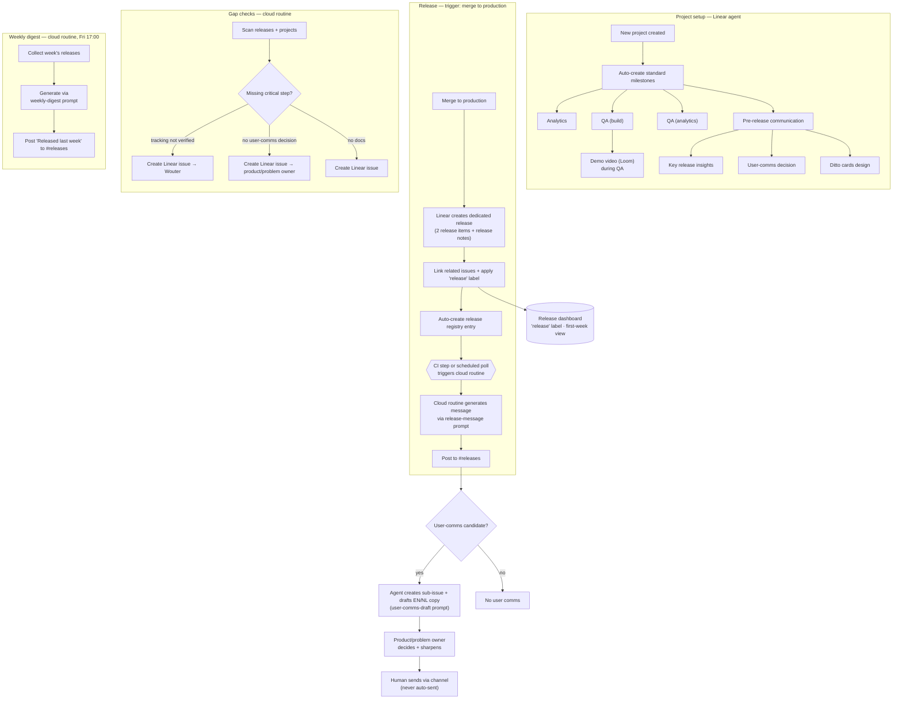

# Release Process & Release Agent — Design Doc

> **Status:** Draft v0.6 — adds demo videos (Loom during QA) + a user-facing comms drafting pipeline (sub-issue → owner approval, never auto-sent). Architecture locked: two Claude routines (per-release via Call-via-API from CI; digest via Schedule), Linear + Slack connectors. Remaining opens in §8.
> **Owner:** Merlijn · **Created:** 2026-06-19 · **Updated:** 2026-06-19
> **Scope:** The *process + communications* side of releasing. Not the build/QC/deploy pipeline ([Ways of Working](https://dittocare.atlassian.net/wiki/spaces/DP/pages/219512846)).
> **Companion files:** `pm-workspace/prompts/release/release-message.md`, `pm-workspace/prompts/release/release-notes.md`, `pm-workspace/prompts/release/weekly-digest.md`

---

## 1. Why now

We have the *policy* (Confluence "Shipping & Release") but not the *machine*. Enforcement is manual and inconsistent. The page itself admits "we've repeatedly shipped without tracking and it blocks evaluation for weeks." The move to Linear gives us dedicated release objects, labels, and automations we weren't using.

**Goal:** A reliable, low-effort release routine where the team always knows what shipped, every release has its tracking, docs, and user-comms decision made *before* it goes out, and a **Release Agent** does the heavy lifting (drafting, reminding, creating issues for gaps) while humans stay in the loop on anything user-facing.

---

## 2. The model in one paragraph

Releases are governed in two places. **Linear** owns the structure: every new project auto-gets a standard set of milestones (including a new **pre-release communication** milestone and a **demo-video** step in QA), and every merge to production creates a dedicated release that links its issues and carries the `release` label. The **Release Agent** (Claude routines) does the rest: a per-release routine (triggered via API from CI) posts the #releases message and writes the Linear release notes; a scheduled routine generates the weekly "Released last week" digest and opens Linear issues for missing critical steps. Internal comms are automated. User-facing comms are only ever drafted: the agent creates a sub-issue with EN/NL copy, the **product/problem owner** decides whether it ships, and a human sends. Never auto-sent.

---

## 3. Current state + decisions

| Topic | Decision / Current state |
|---|---|
| **Linear release object** | New Linear "releases" functionality. You create dedicated releases for **backend, mobile, and big care backend services**. Each links all related issues. |
| **Release trigger** | **Merge to production.** Creates a dedicated release (2 release items + release notes — see §8). Already live: release notes are auto-created in Linear. |
| **`release` label** | Already in use to filter what shipped in the first week (analytics). On release-done, auto-creates a dedicated release registry entry. |
| **Per-release #releases message** | To build: a Claude routine (Call-via-API from CI) that generates and **auto-posts** the internal #releases message + writes the Linear release notes. Uses the `release-message` + `release-notes` prompts. |
| **Weekly "Released last week" digest** | **Auto-generated, Friday 17:00** (see §8 on cadence). Uses the `weekly-digest` prompt. Synthesizes the week's releases. |
| **User-comms decision** | **Product / problem owner** (often Merlijn) decides whether a release needs user communication. |
| **User-facing comms** | Never auto-sent. Agent creates a sub-issue + drafts EN/NL copy per the Communication Matrix (Explore / Exploit / Polish); owner decides + a human sends. |
| **Demo videos** | *New:* short Loom + voiceover captured during QA (even on dev), linked on the release. Builds an internal catalog; user-facing library is a higher-bar future option. |
| **Release docs** | Live in **Linear**. |
| **Tracking checklist** | Policy (5-item pre-release checklist on Confluence). Owned by **Wouter**. |
| **Dashboard** | Team-facing, watched during the first week. Driven by the `release` label. Agent keeps it current. (Home surface: see §8.) |
| **Old workflow** | `pm-workspace/workflows/shipping-and-release.md` is Jira-era and stale. This effort supersedes it. |

---

## 4. Project milestone structure (Linear, auto-created)

When a new project is created, the routine auto-creates a standard set of milestones:

- **Analytics** — tracking definition.
- **QA (build)** — QA on the feature itself; capture a short **demo video** (Loom + voiceover) during QA, even on dev.
- **QA (analytics)** — QA on the tracking.
- **Pre-release communication** *(new)* — contains:
  - Writing the **key release insights**.
  - The **user-comms decision** (product/problem owner): if a candidate, a sub-issue with drafted EN/NL copy to sharpen and approve.
  - **Design for new Ditto cards** (in-app).

This is what makes the comms decision and the release narrative exist *before* release, not after.

---

## 5. Process map

---

## 6. Architecture

Linear can't post the synthesized release message itself, confirmed against the docs:
- **Agent automations are triage-only** (Team Settings → Triage → Agent behavior; fire on issues entering Triage). No "on release → Slack" automation exists.
- **Native Slack notifications are templated cards** (view subscriptions post a stock "completed" card), not a prompt-generated narrative.
- **There is no `Release` webhook event.** Linear's webhook resource types are Issue, Comment, Project, ProjectUpdate, Initiative, Cycle, Customer, etc. So you cannot webhook directly on "release available."

So the work is split between **what Linear does natively** and the **Release Agent**, implemented as **Claude Routines** (scheduled Claude agents via `/schedule`), which does everything Linear can't.

| | **Linear (native)** | **Claude Routine(s) — the Release Agent** |
|---|---|---|
| **Runs** | In Linear + CI | Claude routine (cloud), connectors available per run (incl. Linear + Slack) |
| **Triggers** | merge-to-prod (CI action) | Per-release routine: **Call via API** from CI. Digest routine: **Schedule** (Fri 17:00). |
| **Does** | On new project: auto-create milestones. On merge-to-prod: create release, link issues, apply `release` label, auto-generate release notes (Linear agent) | CI passes release URL + issue IDs → routine reads those **issues** via the Linear connector (releases aren't in the connector; issues are) → generate the per-release Slack message + Linear release notes (and, separately, the weekly digest) via the prompts → post the message to #releases via the **Slack connector** and write the notes to the Linear release. Scan for missing critical steps → create/assign Linear issues (tracking → Wouter; user-comms candidate → sub-issue with drafted copy for the product/problem owner). Keep dashboard current. |
| **Autonomy** | n/a | Auto for internal comms + gap-fixing issues. Never sends user-facing comms. |

**Triggers.** Claude routines support three: **Call via API**, **Schedule** (cron), **GitHub event** (needs a selected repo). Choices:
- **Per-release message → Call via API.** Each pipeline's CI workflow calls the routine right after `linear/linear-release-action` creates the release, passing the release URL + included issue IDs. One routine covers all pipelines, real-time, no polling/checkpoint, and it sidesteps the releases-API gap (the routine reads *issues*, which the Linear connector can). Cost: one curl step per pipeline's CI workflow.
- **Digest → Schedule**, Friday 17:00.
- _Fallback if you'd rather not touch CI:_ Schedule-poll the per-release routine too — but the Linear connector can't list releases, so it'd need a direct GraphQL call + a checkpoint. Call-via-API is cleaner.

**Shape — two routines:** `release-notes-to-slack-internal` (Call via API) and a weekly digest routine (Schedule).

**Runtime requirements:**
- **Connectors** — trim each routine to **Linear + Slack only** (the UI grants unrestricted writes to every enabled connector; least privilege matters). Optional: Atlassian if pulling OKR context from the Confluence OKR page.
- **Secrets** — the Call-via-API **token** (generated on save) stored as a CI secret in each repo. Connector auth (Linear/Slack OAuth) is managed in the routine UI, not as code secrets.
- **Idempotency** — not needed for the Call-via-API path (one call = one release, fire and forget). Only relevant if you fall back to polling.

**Boundary rule:** internal comms and gap-fixing issues are automated. Anything user-facing is drafted only (sub-issue), and the product/problem owner gates whether it ships.

---

## 7. Release communication prompts

Three dedicated prompt files (companion files above) drive the agent's output. All share the same high-level overview — **What shipped / Why it's important / Who notices / Links**, each ≤ 2 sentences, OKR referenced where possible, Linear release link always.

| Prompt | Output | Audience / tone |
|---|---|---|
| `release-message.md` | Per-release **Slack** message in #releases | Whole team; plain, non-technical, overview only |
| `release-notes.md` | Per-release **Linear** notes (documentation) | Team + future reference; same overview **plus** a 🛠 Technical documentation section; may be more technical |
| `user-comms-draft.md` | **Sub-issue** draft of user-facing copy (EN/NL) | Users (via owner approval); brand voice, benefit-first, GDPR-safe |
| `weekly-digest.md` | Weekly **Slack** "Released last week" synthesis | Whole team; scannable, grouped by OKR/theme |

Each release produces **two internal artifacts** from the same context (Slack ping + Linear notes); a user-comms draft is created only when a release is a user-comms candidate. A **demo video (Loom)** link, when captured during QA, is included in all of them. The weekly digest reuses the per-release outputs.

---

## 8. Open items

**Resolved**
- **Runtime** → Claude routines (cloud); Linear + Slack connectors available per run.
- **Trigger** → per-release message via **Call via API** (invoked by CI right after the release is created); weekly digest via **Schedule** (Fri 17:00).
- **Idempotency** → not needed on the Call-via-API path (one call = one release).
- **Connectors** → trim each routine to Linear + Slack (unrestricted writes per enabled connector).

**To confirm**
1. **CI wiring** — add the curl-to-routine step after `linear/linear-release-action` in each pipeline (backend / mobile / care). Who owns adding it?
2. **Digest cadence/autonomy** — weekly Fri 17:00; auto-post, or draft-and-wait for your one-click OK?
3. **"Two release items"** — what are the two each release creates? Affects which the message references.
4. **Channel name** — **#releases** (vs the current #releases-mobile)? New channel, or rename?
5. **Dashboard home** — Linear view, Slack canvas, or standalone surface?
6. **Release notes → Linear** — does the routine write the `release-notes.md` output to the Linear release item automatically, and how does that relate to Linear's own auto-generated release notes (replace them, or complement as a separate doc)?
7. **User-comms trigger** — what flags a release/issue as a user-comms candidate (a Linear label, the owner's call, or the agent's judgment)? And who is the default "problem owner"?
8. **Demo video catalog** — where do the Looms live (Loom folder/workspace, a Linear doc, or a Slack canvas)? And is recording a QA gate or best-effort to start?
